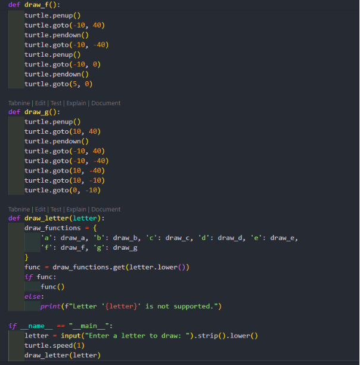
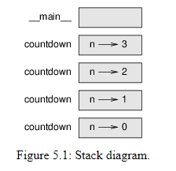

# **PYTHON**

## **COURSE #1: FUNDAMENTAL**

- **Target:** Understand structure of Python language (version 3.8), do practices and have a knowledge about how to write good quality code.
### **PART I: Basic**
#### **Chapter 1: The way of the Program**

1. ##### What is a program ?
   A program is a set of instructions for performing computations. Every programming language includes basic instructions: **input, output, math, condition checking, and repetition**. Programming is the process of breaking down complex tasks into simpler steps using these instructions.
1. ##### Running Python ?

- Python interpreter
- Run Python on browser (PythonAnywhere)

1. ##### The first program 

\>>> print(‘Hello, world!’)

1. ##### Arithmetic operators

- Addition +
- Subtraction - 
- Multiplication \*
- Division /
- Power \*\*

1. ##### Values and types

`	`A **value** is one of the basic things a program works with, like a letter or a number.

`	`Use **type(value)** to check the type of this value. The result is <class ‘type’>
1. ##### Formal and natural languages

- **Natural languages** are the languages people speak, such as English, Spanish, and French. They were not designed by people (although people try to impose some order on them); they evolved naturally.
- **Formal languages** are languages that are designed by people for specific applications. For example, the notation that mathematicians use is a formal language that is particularly good at denoting relationships among numbers and symbols. Chemists use a formal language to represent the chemical structure of molecules
- **Programming languages are formal languages that have been designed to express computations.**
**
`	`Although formal and natural languages have many features in common—tokens,    structure, and syntax—there are some differences:

`	`-    **ambiguity:**Natural languages are full of ambiguity, which people deal with by using contextual clues and other information. Formal languages are designed to be nearly or completely unambiguous, which means that any statement has exactly one meaning, regardless of context.

`  `-     **redundancy:**In order to make up for ambiguity and reduce misunderstandings, natural languages employ lots of redundancy. As a result, they are often verbose. Formal languages are less redundant and more concise.

`  `-     **literalness:**Natural languages are full of idioms and metaphors. If I say, “The penny dropped”, there is probably no penny and nothing dropping (this idiom means that someone understood something after a period of confusion). Formal languages mean exactly what they say.

` `-     **Poetry:**Words are used for their sounds as well as for their meaning, and the whole poem together creates an effect or emotional response. Ambiguity is not only common but often deliberate.

\-      **Prose:**The literal meaning of words is more important, and the structure contributes more meaning. Prose is more amenable to analysis than poetry but still often ambiguous.

\-      **Programs:**The meaning of a computer program is unambiguous and literal, and can be understood entirely by analysis of the tokens and structure.

1. ##### Debugging

- Programmers make mistakes. For whimsical reasons, programming errors are called **bugs** and the process of tracking them down is called **debugging**.

1. ##### Glossary

- **problem solving:** The process of formulating a problem, finding a solution, and expressing it.
- **high-level language:** A programming language like Python that is designed to be easy for humans to read and write.
- **low-level language:** A programming language that is designed to be easy for a computer to run; also called “machine language” or “assembly language”.
- **portability:** A property of a program that can run on more than one kind of computer.
- **interpreter:** A program that reads another program and executes it
- **prompt:** Characters displayed by the interpreter to indicate that it is ready to take input from the user.
- **program:** A set of instructions that specifies a computation.
- **print statement:** An instruction that causes the Python interpreter to display a value on the screen.
- **operator:** A special symbol that represents a simple computation like addition, multiplication, or string concatenation.
- **value:** One of the basic units of data, like a number or string, that a program manipulates.
- **type:** A category of values. The types we have seen so far are integers (type int), floating-point numbers (type float), and strings (type str).
- **integer:** A type that represents whole numbers.
- **floating-point:** A type that represents numbers with fractional parts.
- **string:** A type that represents sequences of characters.
- **natural language:** Any one of the languages that people speak that evolved naturally.
- **formal language:** Any one of the languages that people have designed for specific purposes, such as representing mathematical ideas or computer programs; all programming languages are formal languages.
- **token:** One of the basic elements of the syntactic structure of a program, analogous to a word in a natural language.
- **syntax:** The rules that govern the structure of a program.
- **parse:** To examine a program and analyze the syntactic structure.
- **bug:** An error in a program.
- **debugging:** The process of finding and correcting bugs.

1. ##### Exercises

1) Exercise 1
   
1) Exercise 2

   

#### **Chapter 2: Variables, expressions and statements**

1. ##### Assignment statements
   >>> variable = “value” 

   >>> variable = value

   
1. ##### Variable names

`	`Programmers generally choose names for their variables that are meaningful—they document what the variable is used for.

Variable names can be as long as you like. They can contain both letters and numbers, but they can’t begin with a number. It is legal to use uppercase letters, but it is conventional to use only lower case for variables names.

The underscore character, \_, can appear in a name. It is often used in names with multiple words, such as your\_name or airspeed\_of\_unladen\_swallow.

- It turns out that class is one of Python’s **keywords**. The interpreter uses keywords to recognize the structure of the program, and they cannot be used as variable names.

  

You don’t have to memorize this list. In most development environments, keywords are displayed in a different color; if you try to use one as a variable name, you’ll know.

1. ##### Expressions and statements

`	`An **expression** is a combination of values, variables, and operators. A value all by itself is considered an expression, and so is a variable, so the following are all legal expressions:

\>>> 42

42

\>>> n

17

\>>> n + 25

`        `42

1. ##### Script mode

   So far we have run Python in **interactive mode**, which means that you interact directly with the interpreter. Interactive mode is a good way to get started, but if you are working with more than a few lines of code, it can be clumsy.

1. ##### Order of operations

`	`When an expression contains more than one operator, the order of evaluation depends on the **order of operations**. For mathematical operators, Python follows mathematical convention. The acronym **PEMDAS** is a useful way to remember the rules:

- **P**arentheses have the highest precedence and can be used to force an expression to evaluate in the order you want. Since expressions in parentheses are evaluated first, 2 \* (3-1) is 4, and (1+1)\*\*(5-2) is 8. You can also use parentheses to make an expression easier to read, as in (minute \* 100) / 60, even if it doesn’t change the result.
- **E**xponentiation has the next highest precedence, so 1 + 2\*\*3 is 9, not 27, and 2 \* 3\*\*2 is 18, not 36.
- **M**ultiplication and **D**ivision have higher precedence than **A**ddition and **S**ubtraction. So 2\*3-1 is 5, not 4, and 6+4/2 is 8, not 5.
- Operators with the same precedence are evaluated from left to right (except exponentiation). So in the expression degrees / 2 \* pi, the division happens first and the result is multiplied by pi. To divide by 2 π, you can use parentheses or write degrees / 2 / pi.

  I don’t work very hard to remember the precedence of operators. If I can’t tell by looking at the expression, I use parentheses to make it obvious.

1. ##### String operations

In general, you can’t perform mathematical operations on strings, even if the strings look like numbers, so the following are illegal:

'chinese'-'food'    'eggs'/'easy'    'third'\*'a charm'

But there are two exceptions, + and \*.

1. ##### Comments

   As programs get bigger and more complicated, they get more difficult to read. Formal languages are dense, and it is often difficult to look at a piece of code and figure out what it is doing, or why.

   For this reason, it is a good idea to add notes to your programs to explain in natural language what the program is doing. These notes are called **comments**, and they start with the # symbol
1. ##### Debugging
   Three kinds of errors can occur in a program: syntax errors, runtime errors, and semantic errors. It is useful to distinguish between them in order to track them down more quickly.

   **Syntax error:**

   “Syntax” refers to the structure of a program and the rules about that structure. For example, parentheses have to come in matching pairs, so (1 + 2) is legal, but 8) is a **syntax error**.

   If there is a syntax error anywhere in your program, Python displays an error message and quits, and you will not be able to run the program. During the first few weeks of your programming career, you might spend a lot of time tracking down syntax errors. As you gain experience, you will make fewer errors and find them faster.

   **Runtime error:**

   The second type of error is a runtime error, so called because the error does not appear until after the program has started running. These errors are also called **exceptions** because they usually indicate that something exceptional (and bad) has happened.

   Runtime errors are rare in the simple programs you will see in the first few chapters, so it might be a while before you encounter one.

   **Semantic error:**

   The third type of error is “semantic”, which means related to meaning. If there is a semantic error in your program, it will run without generating error messages, but it will not do the right thing. It will do something else. Specifically, it will do what you told it to do.

   Identifying semantic errors can be tricky because it requires you to work backward by looking at the output of the program and trying to figure out what it is doing.

1. ##### Glossary

- **variable:** A name that refers to a value.
- **assignment:** A statement that assigns a value to a variable.
- **state diagram:** A graphical representation of a set of variables and the values they refer to.
- **keyword:** A reserved word that is used to parse a program; you cannot use keywords like if, def, and while as variable names.
- **operand:** One of the values on which an operator operates.
- **expression:** A combination of variables, operators, and values that represents a single result.
- **evaluate:** To simplify an expression by performing the operations in order to yield a single value.
- **statement:** A section of code that represents a command or action. So far, the statements we have seen are assignments and print statements.
- **execute:** To run a statement and do what it says.
- **interactive mode:** A way of using the Python interpreter by typing code at the prompt.
- **script mode:** A way of using the Python interpreter to read code from a script and run it.
- **script:** A program stored in a file.
- **order of operations:** Rules governing the order in which expressions involving multiple operators and operands are evaluated.
- **concatenate:** To join two operands end-to-end.
- **comment:** Information in a program that is meant for other programmers (or anyone reading the source code) and has no effect on the execution of the program.
- **syntax error:** An error in a program that makes it impossible to parse (and therefore impossible to interpret).
- **exception:** An error that is detected while the program is running.
- **semantics:** The meaning of a program.
- **semantic error:** An error in a program that makes it do something other than what the programmer intended.

1. ##### Exercises

1) Exercise 1:

   

1) Exercise 2:

` 	`

#### **Chapter 3: Functions**

In the context of programming, a **function** is a named sequence of statements that performs a computation. When you define a function, you specify the name and the sequence of statements. Later, you can “call” the function by name.

1. ##### Function calls

   We have already seen one example of a **function call**:

   >>> type(42)

   <class 'int'>

   The name of the function is type. The expression in parentheses is called the **argument** of the function. The result, for this function, is the type of the argument.

   It is common to say that a function “takes” an argument and “returns” a result. The result is also called the **return value**.

1. ##### Math functions
   >>> import math

   >>> math

<module 'math' (built-in)>

The module object contains the functions and variables defined in the module. To access one of the functions, you have to specify the name of the module and the name of the function, separated by a dot (also known as a period). This format is called **dot notation**.

1. ##### Composition

`	`So far, we have looked at the elements of a program—variables, expressions, and statements—in isolation, without talking about how to combine them.

One of the most useful features of programming languages is their ability to take small building blocks and **compose** them. For example, the argument of a function can be any kind of expression, including arithmetic operators:

x = math.sin(degrees / 360.0 \* 2 \* math.pi)

And even function calls:

x = math.exp(math.log(x+1))

Almost anywhere you can put a value, you can put an arbitrary expression, with one exception: the left side of an assignment statement has to be a variable name. Any other expression on the left side is a syntax error (we will see exceptions to this rule later).

\>>> minutes = hours \* 60                 # right

\>>> hours \* 60 = minutes                 # wrong!

SyntaxError: can't assign to operator

1. ##### Adding new functions

   So far, we have only been using the functions that come with Python, but it is also possible to add new functions. A **function definition** specifies the name of a new function and the sequence of statements that run when the function is called.

   def is a keyword that indicates that this is a function definition. The name of the function is print\_lyrics. The rules for function names are the same as for variable names: letters, numbers and underscore are legal, but the first character can’t be a number. You can’t use a keyword as the name of a function, and you should avoid having a variable and a function with the same name.

   The empty parentheses after the name indicate that this function doesn’t take any arguments.

   The first line of the function definition is called the **header**; the rest is called the **body**. The header has to end with a colon and the body has to be indented. By convention, indentation is always four spaces. The body can contain any number of statements.

   The strings in the print statements are enclosed in double quotes. Single quotes and double quotes do the same thing; most people use single quotes except in cases like this where a single quote (which is also an apostrophe) appears in the string.

   All quotation marks (single and double) must be “straight quotes”, usually located next to Enter on the keyboard. “Curly quotes”, like the ones in this sentence, are not legal in Python.

   If you type a function definition in interactive mode, the interpreter prints dots (...) to let you know that the definition isn’t complete:

   >>> def print\_lyrics():

   ...     print("I'm a lumberjack, and I'm okay.")

   ...     print("I sleep all night and I work all day.")

   ...

   To end the function, you have to enter an empty line.

   Once you have defined a function, you can use it inside another function. For example, to repeat the previous refrain, we could write a function called repeat\_lyrics:

   def repeat\_lyrics():

   `    `print\_lyrics()

   `    `print\_lyrics()

1. ##### Definitions and uses
   Function definitions get executed just like other statements, but the effect is to create function objects. The statements inside the function do not run until the function is called, and the function definition generates no output.

   As you might expect, you have to create a function before you can run it. In other words, the function definition has to run before the function gets called.

1. ##### Flow of execution

`	`To ensure that a function is defined before its first use, you have to know the order statements run in, which is called the **flow of execution**.

Execution always begins at the first statement of the program. Statements are run one at a time, in order from top to bottom.

Function definitions do not alter the flow of execution of the program, but remember that statements inside the function don’t run until the function is called.

A function call is like a detour in the flow of execution. Instead of going to the next statement, the flow jumps to the body of the function, runs the statements there, and then comes back to pick up where it left off.

That sounds simple enough, until you remember that one function can call another. While in the middle of one function, the program might have to run the statements in another function. Then, while running that new function, the program might have to run yet another function!

Fortunately, Python is good at keeping track of where it is, so each time a function completes, the program picks up where it left off in the function that called it. When it gets to the end of the program, it terminates.

In summary, when you read a program, you don’t always want to read from top to bottom. Sometimes it makes more sense if you follow the flow of execution.
1. ##### Parameters and arguments
`	`Inside the function, the arguments are assigned to variables called **parameters**.

`	`The argument is evaluated before the function is called

1. ##### Variables and parameters are local

`	`When you create a variable inside a function, it is **local**, which means that it only exists inside the function.

Parameters are also local

1. ##### Stack diagrams

   To keep track of which variables can be used where, it is sometimes useful to draw a **stack diagram**. Like state diagrams, stack diagrams show the value of each variable, but they also show the function each variable belongs to.

   Each function is represented by a **frame**. A frame is a box with the name of a function beside it and the parameters and variables of the function inside it.

   

   This list of functions is called a **traceback**. It tells you what program file the error occurred in, and what line, and what functions were executing at the time. It also shows the line of code that caused the error.

   The order of the functions in the traceback is the same as the order of the frames in the stack diagram. The function that is currently running is at the bottom.
1. ##### Fruitful functions and void functions
`	`Some of the functions we have used, such as the math functions, return results; for lack of a better name, I call them **fruitful functions**. Other functions, like print\_twice, perform an action but don’t return a value. They are called **void functions**.

`	`When you call a fruitful function, you almost always want to do something with the result

`	`When you call a function in interactive mode, Python displays the result:

\>>> math.sqrt(5)

2\.2360679774997898

But in a script, if you call a fruitful function all by itself, the return value is lost forever!

math.sqrt(5)

Void functions might display something on the screen or have some other effect, but they don’t have a return value. If you assign the result to a variable, you get a special value called None.

1. ##### Why functions ?

`	`It may not be clear why it is worth the trouble to divide a program into functions. There are several reasons:

- Creating a new function gives you an opportunity to name a group of statements, which makes your program easier to read and debug.
- Functions can make a program smaller by eliminating repetitive code. Later, if you make a change, you only have to make it in one place.
- Dividing a long program into functions allows you to debug the parts one at a time and then assemble them into a working whole.
- Well-designed functions are often useful for many programs. Once you write and debug one, you can reuse it.

1. ##### Debugging
`	`One of the most important skills you will acquire is debugging. Although it can be frustrating, debugging is one of the most intellectually rich, challenging, and interesting parts of programming.

In some ways debugging is like detective work. You are confronted with clues and you have to infer the processes and events that led to the results you see.

Debugging is also like an experimental science. Once you have an idea about what is going wrong, you modify your program and try again. If your hypothesis was correct, you can predict the result of the modification, and you take a step closer to a working program. If your hypothesis was wrong, you have to come up with a new one. As Sherlock Holmes pointed out, “When you have eliminated the impossible, whatever remains, however improbable, must be the truth.” (A. Conan Doyle, *The Sign of Four*)
1. ##### Glossary

- **function:** A named sequence of statements that performs some useful operation. Functions may or may not take arguments and may or may not produce a result.
- **function definition:** A statement that creates a new function, specifying its name, parameters, and the statements it contains.
- **function object:** A value created by a function definition. The name of the function is a variable that refers to a function object.
- **header:** The first line of a function definition.
- **body:** The sequence of statements inside a function definition.
- **parameter:** A name used inside a function to refer to the value passed as an argument.
- **function call:** A statement that runs a function. It consists of the function name followed by an argument list in parentheses.
- **argument:** A value provided to a function when the function is called. This value is assigned to the corresponding parameter in the function.
- **local variable:** A variable defined inside a function. A local variable can only be used inside its function.
- **return value:** The result of a function. If a function call is used as an expression, the return value is the value of the expression.
- **fruitful function:** A function that returns a value.
- **void function:** A function that always returns None.
- **None:** A special value returned by void functions.
- **module:** A file that contains a collection of related functions and other definitions.
- **import statement:** A statement that reads a module file and creates a module object.
- **module object:** A value created by an import statement that provides access to the values defined in a module.
- **dot notation:** The syntax for calling a function in another module by specifying the module name followed by a dot (period) and the function name.
- **composition:** Using an expression as part of a larger expression, or a statement as part of a larger statement.
- **flow of execution:** The order statements run in.
- **stack diagram:** A graphical representation of a stack of functions, their variables, and the values they refer to.
- **frame:** A box in a stack diagram that represents a function call. It contains the local variables and parameters of the function.
- **traceback:** A list of the functions that are executing, printed when an exception occurs.

1. ##### Exercises

1) Exercise 1:

`		`

1) Exercise 2:

`	`

1) Exercise 3:

`	`

#### **Chapter 4: Case study: interface design**

`	`This chapter presents a case study that demonstrates a process for designing functions that work together.

It introduces the turtle module, which allows you to create images using turtle graphics.
1. ##### The turtle module
   `	`This means that bob refers to an object with type Turtle as defined in module turtle.

   mainloop tells the window to wait for the user to do something, although in this case there’s not much for the user to do except close the window.

   Once you create a Turtle, you can call a **method** to move it around the window. A method is similar to a function, but it uses slightly different syntax.

   The method, fd, is associated with the turtle object we’re calling bob. Calling a method is like making a request: you are asking bob to move forward.

   The argument of fd is a distance in pixels, so the actual size depends on your display.

   Other methods you can call on a Turtle are bk to move backward, lt for left turn, and rt right turn. The argument for lt and rt is an angle in degrees

   Also, each Turtle is holding a pen, which is either down or up; if the pen is down, the Turtle leaves a trail when it moves. The methods pu and pd stand for “pen up” and “pen down”.
1. ##### Simple repetition
   The syntax of a for statement is similar to a function definition. It has a header that ends with a colon and an indented body. The body can contain any number of statements.

   `	`A for statement is also called a **loop** because the flow of execution runs through the body and then loops back to the top. In this case, it runs the body four times.

   This version is actually a little different from the previous square-drawing code because it makes another turn after drawing the last side of the square. The extra turn takes more time, but it simplifies the code if we do the same thing every time through the loop. This version also has the effect of leaving the turtle back in the starting position, facing in the starting direction.
1. ##### Exercises
   1

   

   2

   

   3

   

   4

   

   5

   

1. ##### Encapsulation

   `	`Wrapping a piece of code up in a function is called **encapsulation**. One of the benefits of encapsulation is that it attaches a name to the code, which serves as a kind of documentation. Another advantage is that if you reuse the code, it is more concise to call a function twice than to copy and paste the body!

1. ##### Generalization

`	`Adding a parameter to a function is called **generalization** because it makes the function more general: in the previous version, the square is always the same size; in this version it can be any size.

When a function has more than a few numeric arguments, it is easy to forget what they are, or what order they should be in.

These are called **keyword arguments** because they include the parameter names as “keywords” (not to be confused with Python keywords like while and def).

This syntax makes the program more readable. It is also a reminder about how arguments and parameters work: when you call a function, the arguments are assigned to the parameters.

1. ##### Interface design
   `	`The **interface** of a function is a summary of how it is used: what are the parameters? What does the function do? And what is the return value? An interface is “clean” if it allows the caller to do what they want without dealing with unnecessary details.

1. ##### Refactoring

`	`This process—rearranging a program to improve interfaces and facilitate code reuse—is called **refactoring**. In this case, we noticed that there was similar code in arc and polygon, so we “factored it out” into polyline.

If we had planned ahead, we might have written polyline first and avoided refactoring, but often you don’t know enough at the beginning of a project to design all the interfaces. Once you start coding, you understand the problem better. Sometimes refactoring is a sign that you have learned something.
1. ##### A development plan
`		`A **development plan** is a process for writing programs. The process we used in this case study is “encapsulation and generalization”. The steps of this process are:

1. Start by writing a small program with no function definitions.
1. Once you get the program working, identify a coherent piece of it, encapsulate the piece in a function and give it a name.
1. Generalize the function by adding appropriate parameters.
1. Repeat steps 1–3 until you have a set of working functions. Copy and paste working code to avoid retyping (and re-debugging).
1. Look for opportunities to improve the program by refactoring. For example, if you have similar code in several places, consider factoring it into an appropriately general function.

   This process has some drawbacks—we will see alternatives later—but it can be useful if you don’t know ahead of time how to divide the program into functions. This approach lets you design as you go along.
#####
1. ##### docstring

   By convention, all docstrings are triple-quoted strings, also known as multiline strings because the triple quotes allow the string to span more than one line.

   It is terse, but it contains the essential information someone would need to use this function. It explains concisely what the function does (without getting into the details of how it does it). It explains what effect each parameter has on the behavior of the function and what type each parameter should be (if it is not obvious).

   Writing this kind of documentation is an important part of interface design. A well-designed interface should be simple to explain; if you have a hard time explaining one of your functions, maybe the interface could be improved.
1. ##### Debugging

`	`An interface is like a contract between a function and a caller. The caller agrees to provide certain parameters and the function agrees to do certain work.

For example, polyline requires four arguments: t has to be a Turtle; n has to be an integer; length should be a positive number; and angle has to be a number, which is understood to be in degrees.

These requirements are called **preconditions** because they are supposed to be true before the function starts executing. Conversely, conditions at the end of the function are **postconditions**. Postconditions include the intended effect of the function (like drawing line segments) and any side effects (like moving the Turtle or making other changes).

Preconditions are the responsibility of the caller. If the caller violates a (properly documented!) precondition and the function doesn’t work correctly, the bug is in the caller, not the function.

If the preconditions are satisfied and the postconditions are not, the bug is in the function. If your pre- and postconditions are clear, they can help with debugging.
1. ##### Glossary

- **method:** A function that is associated with an object and called using dot notation.
- **loop:** A part of a program that can run repeatedly.
- **encapsulation:** The process of transforming a sequence of statements into a function definition.
- **generalization:** The process of replacing something unnecessarily specific (like a number) with something appropriately general (like a variable or parameter).
- **keyword argument:** An argument that includes the name of the parameter as a “keyword”.
- **interface:** A description of how to use a function, including the name and descriptions of the arguments and return value.
- **refactoring:** The process of modifying a working program to improve function interfaces and other qualities of the code.
- **development plan:** A process for writing programs.
- **docstring:** A string that appears at the top of a function definition to document the function’s interface.
- **precondition:** A requirement that should be satisfied by the caller before a function starts.
- **postcondition:** A requirement that should be satisfied by the function before it ends.

1. ##### Exercises

1) Exercise 1:

`		`

1) Exercise 2:

   ` `

1) Exercise 4:

`	`

1) Exercise 5:

`	`

#### **Chapter 5: Conditionals and recursion**

1. ##### Floor division and modulus

`	`The **floor division** operator, //, divides two numbers and rounds down to an integer.

`	`An alternative is to use the **modulus operator**, %, which divides two numbers and returns the remainder.

1. ##### Boolean expression

`	`A **boolean expression** is an expression that is either true or false. 

`	`True and False are special values that belong to the type bool; they are not strings:

\>>> type(True)

<class 'bool'>

\>>> type(False)

<class 'bool'>

The == operator is one of the **relational operators**; the others are:

`     `x != y               # x is not equal to y

`      `x > y                # x is greater than y

`      `x < y                # x is less than y

`      `x >= y               # x is greater than or equal to y

`      `x <= y               # x is less than or equal to y

Although these operations are probably familiar to you, the Python symbols are different from the mathematical symbols. A common error is to use a single equal sign (=) instead of a double equal sign (==). Remember that = is an assignment operator and == is a relational operator. There is no such thing as =< or =>.

1. ##### Logical operators

   There are three **logical operators**: and, or, and not. The semantics (meaning) of these operators is similar to their meaning in English.

1. ##### Conditional execution

`	`In order to write useful programs, we almost always need the ability to check conditions and change the behavior of the program accordingly. **Conditional statements** give us this ability.

The boolean expression after if is called the **condition**. If it is true, the indented statement runs. If not, nothing happens.

if statements have the same structure as function definitions: a header followed by an indented body. Statements like this are called **compound statements**.

There is no limit on the number of statements that can appear in the body, but there has to be at least one. Occasionally, it is useful to have a body with no statements (usually as a place keeper for code you haven’t written yet). In that case, you can use the pass statement, which does nothing.
1. ##### Alternative execution
   `	`A second form of the if statement is “alternative execution”, in which there are two possibilities and the condition determines which one runs. The syntax looks like this:

   if x % 2 == 0:

   `    `print('x is even')

   else:

   `    `print('x is odd')

   If the remainder when x is divided by 2 is 0, then we know that x is even, and the program displays an appropriate message. If the condition is false, the second set of statements runs. Since the condition must be true or false, exactly one of the alternatives will run. The alternatives are called **branches**, because they are branches in the flow of execution.
1. ##### Chained conditionals
   Sometimes there are more than two possibilities and we need more than two branches. One way to express a computation like that is a **chained conditional**:

   if x < y:

   `    `print('x is less than y')

   elif x > y:

   `    `print('x is greater than y')

   else:

   `    `print('x and y are equal')

   elif is an abbreviation of “else if”. Again, exactly one branch will run. There is no limit on the number of elif statements. If there is an else clause, it has to be at the end, but there doesn’t have to be one.

   if choice == 'a':

   `    `draw\_a()

   elif choice == 'b':

   `    `draw\_b()

   elif choice == 'c':

   `    `draw\_c()

   Each condition is checked in order. If the first is false, the next is checked, and so on. If one of them is true, the corresponding branch runs and the statement ends. Even if more than one condition is true, only the first true branch runs.

1. ##### Nested conditionals

`	`One conditional can also be nested within another.

`	`The outer conditional contains two branches. The first branch contains a simple statement. The second branch contains another if statement, which has two branches of its own. Those two branches are both simple statements, although they could have been conditional statements as well.

Although the indentation of the statements makes the structure apparent, **nested conditionals** become difficult to read very quickly. It is a good idea to avoid them when you can.

Logical operators often provide a way to simplify nested conditional statements.
1. ##### Recursion

`	`It is legal for one function to call another; it is also legal for a function to call itself. It may not be obvious why that is a good thing, but it turns out to be one of the most magical things a program can do. 

A function that calls itself is **recursive**; the process of executing it is called **recursion**.

1. ##### Stack diagrams for recursive functions

`	`

`	`As usual, the top of the stack is the frame for \_\_main\_\_. It is empty because we did not create any variables in \_\_main\_\_ or pass any arguments to it.

The four countdown frames have different values for the parameter n. The bottom of the stack, where n=0, is called the **base case**. It does not make a recursive call, so there are no more frames.

As an exercise, draw a stack diagram for print\_n called with s = 'Hello' and n=2. Then write a function called do\_n that takes a function object and a number, n, as arguments, and that calls the given function n times.
1. ##### Infinite recursion 
   `	`If a recursion never reaches a base case, it goes on making recursive calls forever, and the program never terminates. This is known as **infinite recursion**, and it is generally not a good idea.

   If you encounter an infinite recursion by accident, review your function to confirm that there is a base case that does not make a recursive call. And if there is a base case, check whether you are guaranteed to reach it.

1. ##### Keyboard input
   `	`The programs we have written so far accept no input from the user. They just do the same thing every time.

   Python provides a built-in function called input that stops the program and waits for the user to type something. When the user presses Return or Enter, the program resumes and input returns what the user typed as a string.

   Before getting input from the user, it is a good idea to print a prompt telling the user what to type. input can take a prompt as an argument:

   The sequence \n at the end of the prompt represents a **newline**, which is a special character that causes a line break. That’s why the user’s input appears below the prompt.

`	`But if the user types something other than a string of digits, you get an error:

1. ##### Debugging

`	`When a syntax or runtime error occurs, the error message contains a lot of information, but it can be overwhelming. The most useful parts are usually:

- What kind of error it was, and
- Where it occurred.

  Syntax errors are usually easy to find, but there are a few gotchas. Whitespace errors can be tricky because spaces and tabs are invisible and we are used to ignoring them.

  >>> x = 5

  >>>  y = 6

  `  `File "<stdin>", line 1

  `    `y = 6

  `    `^

  IndentationError: unexpected indent

  In this example, the problem is that the second line is indented by one space. But the error message points to y, which is misleading. In general, error messages indicate where the problem was discovered, but the actual error might be earlier in the code, sometimes on a previous line.

  The same is true of runtime errors. Suppose you are trying to compute a signal-to-noise ratio in decibels. The formula is <i>SNRdb</i> = 10 log10 (<i>Psignal</i> / <i>Pnoise</i>). In Python, you might write something like this:

  import math

  signal\_power = 9

  noise\_power = 10

  ratio = signal\_power // noise\_power

  decibels = 10 \* math.log10(ratio)

  print(decibels)

  When you run this program, you get an exception:

  Traceback (most recent call last):

  `  `File "snr.py", line 5, in ?

  `    `decibels = 10 \* math.log10(ratio)

  ValueError: math domain error

  The error message indicates line 5, but there is nothing wrong with that line. To find the real error, it might be useful to print the value of ratio, which turns out to be 0. The problem is in line 4, which uses floor division instead of floating-point division.

  You should take the time to read error messages carefully, but don’t assume that everything they say is correct.
1. ##### Glossary

- **floor division:** An operator, denoted //, that divides two numbers and rounds down (toward negative infinity) to an integer.
- **modulus operator:** An operator, denoted with a percent sign (%), that works on integers and returns the remainder when one number is divided by another.
- **boolean expression:** An expression whose value is either True or False.
- **relational operator:** One of the operators that compares its operands: ==, !=, >, <, >=, and <=.
- **logical operator:** One of the operators that combines boolean expressions: and, or, and not.
- **conditional statement:** A statement that controls the flow of execution depending on some condition.
- **condition:** The boolean expression in a conditional statement that determines which branch runs.
- **compound statement:** A statement that consists of a header and a body. The header ends with a colon (:). The body is indented relative to the header.
- **branch:** One of the alternative sequences of statements in a conditional statement.
- **chained conditional:** A conditional statement with a series of alternative branches.
- **nested conditional:** A conditional statement that appears in one of the branches of another conditional statement.
- **return statement:** A statement that causes a function to end immediately and return to the caller.
- **recursion:** The process of calling the function that is currently executing.
- **base case:** A conditional branch in a recursive function that does not make a recursive call.
- **infinite recursion:** A recursion that doesn’t have a base case, or never reaches it. Eventually, an infinite recursion causes a runtime error.

1. ##### Exercises
1) Exercise 1:

   

   

1) Exercise 2:

`	`

1) Exercise 3:

`	`

1) Exercise 4:

`	`

`     `recurse(-1, 0) calls recurse(-2, -1), then recurse(-3, -3), and so on...

1) Exercise 5:

`	`

1) Exercise 6:

`	`

#### **Chapter 6: Fruitful functions**

1. ##### Return values

`	`Calling the function generates a return value, which we usually assign to a variable or use as part of an expression.

`	`On the other hand, **temporary variables** like a can make debugging easier.

`	`As soon as a return statement runs, the function terminates without executing any subsequent statements. Code that appears after a return statement, or any other place the flow of execution can never reach, is called **dead code**.

In a fruitful function, it is a good idea to ensure that every possible path through the program hits a return statement.
1. ##### Incremental development
   As you write larger functions, you might find yourself spending more time debugging.

   To deal with increasingly complex programs, you might want to try a process called **incremental development**. The goal of incremental development is to avoid long debugging sessions by adding and testing only a small amount of code at a time.

   When you start out, you should add only a line or two of code at a time. As you gain more experience, you might find yourself writing and debugging bigger chunks. Either way, incremental development can save you a lot of debugging time.

   The key aspects of the process are:

1. Start with a working program and make small incremental changes. At any point, if there is an error, you should have a good idea where it is.
1. Use variables to hold intermediate values so you can display and check them.
1. Once the program is working, you might want to remove some of the scaffolding or consolidate multiple statements into compound expressions, but only if it does not make the program difficult to read.

   As an exercise, use incremental development to write a function called hypotenuse that returns the length of the hypotenuse of a right triangle given the lengths of the other two legs as arguments. Record each stage of the development process as you go.

1. ##### Composition

`	`As you should expect by now, you can call one function from within another.

1. ##### Boolean functions

   `	`Functions can return booleans, which is often convenient for hiding complicated tests inside functions. 

1. ##### More recursion

`	`Python can represent any computable program, according to **Turing's Thesis**.

A **recursive definition** defines a function by referring to itself.

1. ##### Leap of faith

`	`Following the flow of execution is one way to read programs, but it can quickly become overwhelming. An alternative is what I call the “leap of faith”. When you come to a function call, instead of following the flow of execution, you *assume* that the function works correctly and returns the right result.

In fact, you are already practicing this leap of faith when you use built-in functions. When you call math.cos or math.exp, you don’t examine the bodies of those functions. You just assume that they work because the people who wrote the built-in functions were good programmers.

The same is true when you call one of your own functions. For example, in Section [6.4](https://greenteapress.com/thinkpython2/html/thinkpython2007.html#boolean), we wrote a function called is\_divisible that determines whether one number is divisible by another. Once we have convinced ourselves that this function is correct—by examining the code and testing—we can use the function without looking at the body again.

The same is true of recursive programs. When you get to the recursive call, instead of following the flow of execution, you should assume that the recursive call works (returns the correct result) and then ask yourself, “Assuming that I can find the factorial of *n*−1, can I compute the factorial of *n*?” It is clear that you can, by multiplying by *n*.

Of course, it’s a bit strange to assume that the function works correctly when you haven’t finished writing it, but that’s why it’s called a leap of faith!
1. ##### One more example

`	`After factorial, the most common example of a recursively defined mathematical function is fibonacci, which has the following definition (see <http://en.wikipedia.org/wiki/Fibonacci_number>):

||
| :- |

| | |*fibonacci*(0) = 0 |
| -: | :-: | :- |
| | |*fibonacci*(1) = 1 |
| | |*fibonacci*(*n*) = *fibonacci*(*n*−1) + *fibonacci*(*n*−2)|

||
| :- |
Translated into Python, it looks like this:

def fibonacci(n):

`    `if n == 0:

`        `return 0

`    `elif  n == 1:

`        `return 1

`    `else:

`        `return fibonacci(n-1) + fibonacci(n-2)

If you try to follow the flow of execution here, even for fairly small values of *n*, your head explodes. But according to the leap of faith, if you assume that the two recursive calls work correctly, then it is clear that you get the right result by adding them together.

1. ##### Checking types

`	`We have two choices. We can try to generalize the factorial function to work with floating-point numbers, or we can make factorial check the type of its argument. The first option is called the gamma function and it’s a little beyond the scope of this book. So we’ll go for the second.

`	`We can use the built-in function isinstance to verify the type of the argument. 

This program demonstrates a pattern sometimes called a **guardian**. The first two conditionals act as guardians, protecting the code that follows from values that might cause an error. The guardians make it possible to prove the correctness of the code.

1. ##### Debugging

`	`Breaking a large program into smaller functions creates natural checkpoints for debugging. If a function is not working, there are three possibilities to consider:

- There is something wrong with the arguments the function is getting; a precondition is violated.
- There is something wrong with the function; a postcondition is violated.
- There is something wrong with the return value or the way it is being used.

  To rule out the first possibility, you can add a print statement at the beginning of the function and display the values of the parameters (and maybe their types). Or you can write code that checks the preconditions explicitly.

  If the parameters look good, add a print statement before each return statement and display the return value. If possible, check the result by hand. Consider calling the function with values that make it easy to check the result (as in Section [6.2](https://greenteapress.com/thinkpython2/html/thinkpython2007.html#incremental.development)).

  If the function seems to be working, look at the function call to make sure the return value is being used correctly (or used at all!).

  Adding print statements at the beginning and end of a function can help make the flow of execution more visible. For example, here is a version of factorial with print statements:

  def factorial(n):

  `    `space = ' ' \* (4 \* n)

  `    `print(space, 'factorial', n)

  `    `if n == 0:

  `        `print(space, 'returning 1')

  `        `return 1

  `    `else:

  `        `recurse = factorial(n-1)

  `        `result = n \* recurse

  `        `print(space, 'returning', result)

  `        `return result

  space is a string of space characters that controls the indentation of the output. Here is the result of factorial(4) :

  `                `factorial 4

  `             `factorial 3

  `         `factorial 2

  `     `factorial 1

  ` `factorial 0

  ` `returning 1

  `     `returning 1

  `         `returning 2

  `             `returning 6

  `                 `returning 24

  If you are confused about the flow of execution, this kind of output can be helpful. It takes some time to develop effective scaffolding, but a little bit of scaffolding can save a lot of debugging.

1. ##### Glossary

- **temporary variable:** A variable used to store an intermediate value in a complex calculation.
- **dead code:** Part of a program that can never run, often because it appears after a return statement.
- **incremental development:** A program development plan intended to avoid debugging by adding and testing only a small amount of code at a time.
- **scaffolding:** Code that is used during program development but is not part of the final version.
- **guardian:** A programming pattern that uses a conditional statement to check for and handle circumstances that might cause an error.

1. ##### Exercises

1) Exercise 1:

`	`------------------------------------------------

|    Global frame                              |

|    x = 1                                     |

|    y = 2                                     |

|    print(c(1, 5, 3))                         |

\------------------------------------------------

`  	      `|

\------------------------------------------------

|   c frame (x=1, y=5, z=3)                    |

|   total = 9                                  |

|   square = b(9) \*\* 2                         |

\------------------------------------------------

` 	       `|

\------------------------------------------------

|   b frame (z=9)                              |

|   prod = a(9,9)                              |

|   print(9, prod)                             |

\------------------------------------------------

`  	      `|

\------------------------------------------------

|   a frame (x=9, y=9)                         |

|   x = 10                                     |

|   return 10 \* 9 = 90                         |

\------------------------------------------------

9 90

8100

1) Exercise 2:

   

1) Exercise 3:

`	`

1) Exercise 4:

   

1) Exercise 5:

   

   #### **Chapter 7: Iteration**

1. ##### Reassignment

`	`As you may have discovered, it is legal to make more than one assignment to the same variable. A new assignment makes an existing variable refer to a new value (and stop referring to the old value).

\>>> x = 5

At this point I want to address a common source of confusion. Because Python uses the equal sign (=) for assignment, it is tempting to interpret a statement like a = b as a mathematical proposition of equality; that is, the claim that a and b are equal. But this interpretation is wrong.

1. ##### Updating variables

`	`A common kind of reassignment is an **update**, where the new value of the variable depends on the old.

1. ##### The While statement

`	`Computers are often used to automate repetitive tasks. Repeating identical or similar tasks without making errors is something that computers do well and people do poorly. In a computer program, repetition is also called **iteration**.

More formally, here is the flow of execution for a while statement:

1. Determine whether the condition is true or false.
1. If false, exit the while statement and continue execution at the next statement.
1. If the condition is true, run the body and then go back to step 1.

   This type of flow is called a loop because the third step loops back around to the top.

   The body of the loop should change the value of one or more variables so that the condition becomes false eventually and the loop terminates. Otherwise the loop will repeat forever, which is called an **infinite loop**. An endless source of amusement for computer scientists is the observation that the directions on shampoo, “Lather, rinse, repeat”, are an infinite loop.

1. ##### Break

Sometimes you don’t know it’s time to end a loop until you get half way through the body. In that case you can use the break statement to jump out of the loop.

Each time through, it prompts the user with an angle bracket. If the user types done, the break statement exits the loop. Otherwise the program echoes whatever the user types and goes back to the top of the loop.

This way of writing while loops is common because you can check the condition anywhere in the loop (not just at the top) and you can express the stop condition affirmatively (“stop when this happens”) rather than negatively (“keep going until that happens”).
1. ##### Square roots 
   `	`Loops are often used in programs that compute numerical results by starting with an approximate answer and iteratively improving it.

1. ##### Algorithms

`	`Newton’s method is an example of an **algorithm**: it is a mechanical process for solving a category of problems (in this case, computing square roots).

To understand what an algorithm is, it might help to start with something that is not an algorithm. When you learned to multiply single-digit numbers, you probably memorized the multiplication table. In effect, you memorized 100 specific solutions. That kind of knowledge is not algorithmic.

But if you were “lazy”, you might have learned a few tricks. For example, to find the product of *n* and 9, you can write *n*−1 as the first digit and 10−*n* as the second digit. This trick is a general solution for multiplying any single-digit number by 9. That’s an algorithm!

Similarly, the techniques you learned for addition with carrying, subtraction with borrowing, and long division are all algorithms. One of the characteristics of algorithms is that they do not require any intelligence to carry out. They are mechanical processes where each step follows from the last according to a simple set of rules.

Executing algorithms is boring, but designing them is interesting, intellectually challenging, and a central part of computer science.

Some of the things that people do naturally, without difficulty or conscious thought, are the hardest to express algorithmically. Understanding natural language is a good example. We all do it, but so far no one has been able to explain *how* we do it, at least not in the form of an algorithm.

1. ##### Debugging

`	`As you start writing bigger programs, you might find yourself spending more time debugging. More code means more chances to make an error and more places for bugs to hide.

One way to cut your debugging time is “debugging by bisection”. For example, if there are 100 lines in your program and you check them one at a time, it would take 100 steps.

Instead, try to break the problem in half. Look at the middle of the program, or near it, for an intermediate value you can check. Add a print statement (or something else that has a verifiable effect) and run the program.

If the mid-point check is incorrect, there must be a problem in the first half of the program. If it is correct, the problem is in the second half.

Every time you perform a check like this, you halve the number of lines you have to search. After six steps (which is fewer than 100), you would be down to one or two lines of code, at least in theory.

In practice it is not always clear what the “middle of the program” is and not always possible to check it. It doesn’t make sense to count lines and find the exact midpoint. Instead, think about places in the program where there might be errors and places where it is easy to put a check. Then choose a spot where you think the chances are about the same that the bug is before or after the check.

1. ##### Glossary

- **reassignment:** Assigning a new value to a variable that already exists.
- **update:** An assignment where the new value of the variable depends on the old.
- **initialization:** An assignment that gives an initial value to a variable that will be updated.
- **increment:** An update that increases the value of a variable (often by one).
- **decrement:** An update that decreases the value of a variable.
- **iteration:** Repeated execution of a set of statements using either a recursive function call or a loop.
- **infinite loop:** A loop in which the terminating condition is never satisfied.
- **algorithm:** A general process for solving a category of problems.

1. ##### Exercises

1) Exercise 1:

   `	`

	

1) Exercise 2:

   

1) Exercise 3: 

`	`

#### **Chapter 8: Strings**

Strings are not like integers, floats, and booleans. A string is a **sequence**, which means it is an ordered collection of other values. In this chapter you’ll see how to access the characters that make up a string, and you’ll learn about some of the methods strings provide.

1. ##### A string is a sequence

`	`A string is a sequence of characters. You can access the characters one at a time with the bracket operator.

`	`The expression in brackets is called an **index**. The index indicates which character in the sequence you want (hence the name).

1. ##### len
	

   len is a built-in function that returns the number of characters in a string.

1. ##### Traversal with a **for** loop

`	`A lot of computations involve processing a string one character at a time. Often they start at the beginning, select each character in turn, do something to it, and continue until the end. This pattern of processing is called a **traversal**.

As an exercise, write a function that takes a string as an argument and displays the letters backward, one per line.

1. ##### String slices

`	`A segment of a string is called a **slice**. Selecting a slice is similar to selecting a character.

The operator [n:m] returns the part of the string from the “n-eth” character to the “m-eth” character, including the first but excluding the last. This behavior is counterintuitive, but it might help to imagine the indices pointing *between* the characters, as in Figure [8.1](https://greenteapress.com/thinkpython2/html/thinkpython2009.html#fig.banana).

If you omit the first index (before the colon), the slice starts at the beginning of the string. If you omit the second index, the slice goes to the end of the string

If the first index is greater than or equal to the second the result is an **empty string**, represented by two quotation marks

An empty string contains no characters and has length 0, but other than that, it is the same as any other string.

1. ##### Strings are immutable

`	`It is tempting to use the [] operator on the left side of an assignment, with the intention of changing a character in a string.

The reason for the error is that strings are **immutable**, which means you can’t change an existing string. The best you can do is create a new string that is a variation on the original:

1. ##### Searching

`	`This pattern of computation—traversing a sequence and returning when we find what we are looking for—is called a **search**.

1. ##### Looping and counting

`	`The following program counts the number of times the letter a appears in a string:

word = 'banana'

count = 0

for letter in word:

`    `if letter == 'a':

`        `count = count + 1

print(count)

This program demonstrates another pattern of computation called a **counter**. The variable count is initialized to 0 and then incremented each time an a is found. When the loop exits, count contains the result—the total number of a’s.

1. ##### String methods

`	`Strings provide methods that perform a variety of useful operations. A method is similar to a function—it takes arguments and returns a value—but the syntax is different. For example, the method upper takes a string and returns a new string with all uppercase letters.

Instead of the function syntax upper(word), it uses the method syntax word.upper().

A method call is called an **invocation**; in this case, we would say that we are invoking upper on word.

As it turns out, there is a string method named find that is remarkably similar to the function we wrote:

\>>> word = 'banana'

\>>> index = word.find('a')

\>>> index

1

In this example, we invoke find on word and pass the letter we are looking for as a parameter.

Actually, the find method is more general than our function; it can find substrings, not just characters:

\>>> word.find('na')

2

By default, find starts at the beginning of the string, but it can take a second argument, the index where it should start:

\>>> word.find('na', 3)

4

This is an example of an **optional argument**; find can also take a third argument, the index where it should stop:

\>>> name = 'bob'

\>>> name.find('b', 1, 2)

-1

This search fails because b does not appear in the index range from 1 to 2, not including 2. Searching up to, but not including, the second index makes find consistent with the slice operator.

1. ##### The **in** operator

`	`The word in is a boolean operator that takes two strings and returns True if the first appears as a substring in the second

1. ##### String comparison

`	`The relational operators work on strings. To see if two strings are equal:

if word == 'banana':

`    `print('All right, bananas.')

Other relational operations are useful for putting words in alphabetical order:

if word < 'banana':

`    `print('Your word, ' + word + ', comes before banana.')

elif word > 'banana':

`    `print('Your word, ' + word + ', comes after banana.')

else:

`    `print('All right, bananas.')

Python does not handle uppercase and lowercase letters the same way people do. All the uppercase letters come before all the lowercase letters, so:

Your word, Pineapple, comes before banana.

A common way to address this problem is to convert strings to a standard format, such as all lowercase, before performing the comparison. Keep that in mind in case you have to defend yourself against a man armed with a Pineapple.

1. ##### Debugging

When you use indices to traverse the values in a sequence, it is tricky to get the beginning and end of the traversal right. Here is a function that is supposed to compare two words and return True if one of the words is the reverse of the other, but it contains two errors:

def is\_reverse(word1, word2):

`    `if len(word1) != len(word2):

`        `return False

`    `i = 0

`    `j = len(word2)

`    `while j > 0:

`        `if word1[i] != word2[j]:

`            `return False

`        `i = i+1

`        `j = j-1

`    `return True

The first if statement checks whether the words are the same length. If not, we can return False immediately. Otherwise, for the rest of the function, we can assume that the words are the same length. This is an example of the guardian pattern in Section [6.8](https://greenteapress.com/thinkpython2/html/thinkpython2007.html#guardian).

i and j are indices: i traverses word1 forward while j traverses word2 backward. If we find two letters that don’t match, we can return False immediately. If we get through the whole loop and all the letters match, we return True.

If we test this function with the words “pots” and “stop”, we expect the return value True, but we get an IndexError:

\>>> is\_reverse('pots', 'stop')

...

`  `File "reverse.py", line 15, in is\_reverse

`    `if word1[i] != word2[j]:

IndexError: string index out of range

For debugging this kind of error, my first move is to print the values of the indices immediately before the line where the error appears.

`   `while j > 0:

`        `print(i, j)        # print here

`        `if word1[i] != word2[j]:

`            `return False

`        `i = i+1

`        `j = j-1

Now when I run the program again, I get more information:

\>>> is\_reverse('pots', 'stop')

0 4

...

IndexError: string index out of range

The first time through the loop, the value of j is 4, which is out of range for the string 'pots'. The index of the last character is 3, so the initial value for j should be len(word2)-1.

If I fix that error and run the program again, I get:

\>>> is\_reverse('pots', 'stop')

0 3

1 2

2 1

True

This time we get the right answer, but it looks like the loop only ran three times, which is suspicious. To get a better idea of what is happening, it is useful to draw a state diagram. During the first iteration, the frame for is\_reverse is shown in Figure [8.2](https://greenteapress.com/thinkpython2/html/thinkpython2009.html#fig.state4).

-----

||
| :- |
-----
I took some license by arranging the variables in the frame and adding dotted lines to show that the values of i and j indicate characters in word1 and word2.

Starting with this diagram, run the program on paper, changing the values of i and j during each iteration. Find and fix the second error in this function.
1. ##### Glossary

- **object:** Something a variable can refer to. For now, you can use “object” and “value” interchangeably.
- **sequence:** An ordered collection of values where each value is identified by an integer index.
- **item:** One of the values in a sequence.
- **index:** An integer value used to select an item in a sequence, such as a character in a string. In Python indices start from 0.
- **slice:** A part of a string specified by a range of indices.
- **empty string:** A string with no characters and length 0, represented by two quotation marks.
- **immutable:** The property of a sequence whose items cannot be changed.
- **traverse:** To iterate through the items in a sequence, performing a similar operation on each.
- **search:** A pattern of traversal that stops when it finds what it is looking for.
- **counter:** A variable used to count something, usually initialized to zero and then incremented.
- **invocation:** A statement that calls a method.
- **optional argument:** A function or method argument that is not required.

1. ##### Exercises

1) Exercise 1:

`	 `s = "  Hello, Python!  "

`    `print("Original string:", repr(s))

`    `# 1. strip() - Removes leading and trailing whitespace or specified characters

`    `print("strip():", repr(s.strip()))  # "Hello, Python!"

`    `s2 = "---Hello, World!---"

`    `print("strip('-'):", repr(s2.strip("-")))  # "Hello, World!"

`    `# 2. replace() - Replaces a substring within a string

`    `s3 = "I love Java"

`    `print("replace('Java', 'Python'):", s3.replace("Java", "Python"))  # "I love Python"

`    `# 3. find() - Finds the first occurrence of a substring

`    `s4 = "Hello, welcome to Python!"

`    `print("find('Python'):", s4.find("Python"))  # 18

`    `print("find('Java'):", s4.find("Java"))  # -1 (Not found)

`    `# 4. split() - Splits a string into a list

`    `s5 = "apple,banana,cherry"

`    `print("split(','):", s5.split(","))  # ['apple', 'banana', 'cherry']

`    `# 5. join() - Joins a list into a string

`    `words = ["Hello", "Python", "World"]

`    `print("join(' '):", " ".join(words))  # "Hello Python World"

`    `# 6. upper() - Converts to uppercase

`    `print("upper():", s.upper())  # "  HELLO, PYTHON!  "

`    `# 7. lower() - Converts to lowercase

`    `print("lower():", s.lower())  # "  hello, python!  "

`    `# 8. capitalize() - Capitalizes the first letter

`    `print("capitalize():", s.capitalize())  # "  hello, python!  "

`    `# 9. title() - Capitalizes the first letter of each word

`    `print("title():", s.title())  # "  Hello, Python!  "

`    `# 10. count() - Counts occurrences of a substring

`    `print("count('o'):", s.count("o"))  # 2

`    `# 11. startswith() - Checks if string starts with a given substring

`    `print("startswith('Hello'):", s.startswith("Hello"))  # False (due to leading spaces)

`    `# 12. endswith() - Checks if string ends with a given substring

`    `print("endswith('Python!  '):", s.endswith("Python!  "))  # True

`    `# 13. isdigit() - Checks if string contains only digits

`    `s6 = "12345"

`    `print("isdigit():", s6.isdigit())  # True

`    `# 14. isalpha() - Checks if string contains only letters

`    `s7 = "Hello"

`    `print("isalpha():", s7.isalpha())  # True

`    `# 15. isalnum() - Checks if string contains only letters and digits

`    `s8 = "Hello123"

`    `print("isalnum():", s8.isalnum())  # True

1) Exercise 2:

`	`

1) Exercise 3:

`	`

1) Exercise 4:

`	`Function 1: The function **only checks the first character** of s and immediately returns True or False based on that one character.

If the first character is lowercase, it returns True, otherwise, it returns False, **without checking the rest of the string**.

`	`Function 2: The condition if 'c'.islower(): is **incorrect** because it checks if the **literal string 'c'** is lowercase, which is always True.

The function always returns 'True' (as a string) regardless of s.

`	`Function 3: This function **overwrites** flag on each iteration.

At the end of the loop, flag holds the result of c.islower() for the **last character** only.

If the last character is lowercase, it returns True; otherwise, it returns False.

`	`Function 4: Uses flag = flag or c.islower(), which correctly accumulates True **if at least one lowercase letter is found**.

If any lowercase letter appears, flag becomes True and stays True for the rest of the loop.

Correctly returns True if **any** lowercase letter exists in s; otherwise, returns False.

`	`Function 5: This function checks if **all** characters in s are lowercase.

If it finds **any** non-lowercase character, it immediately returns False.

If no non-lowercase characters are found, it returns True.

1) Exercise 5:

`	`

## **COURSE #2: ADVANCED**

